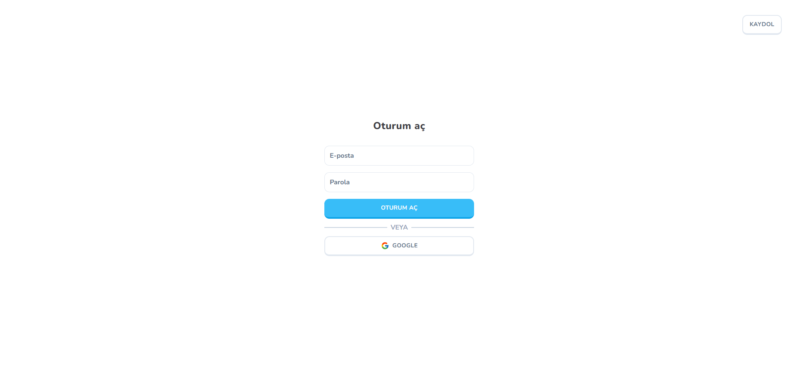
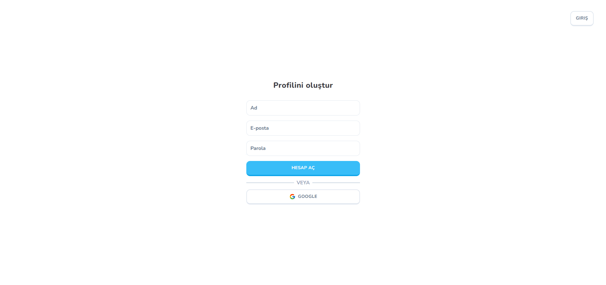
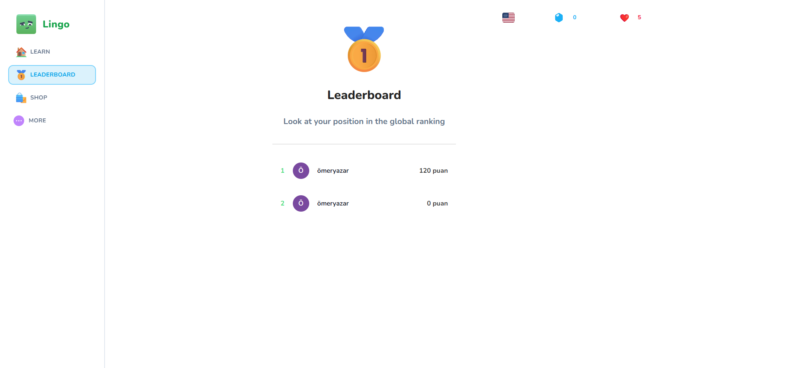
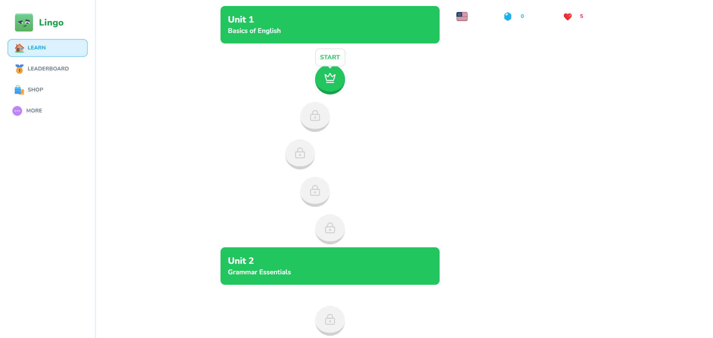
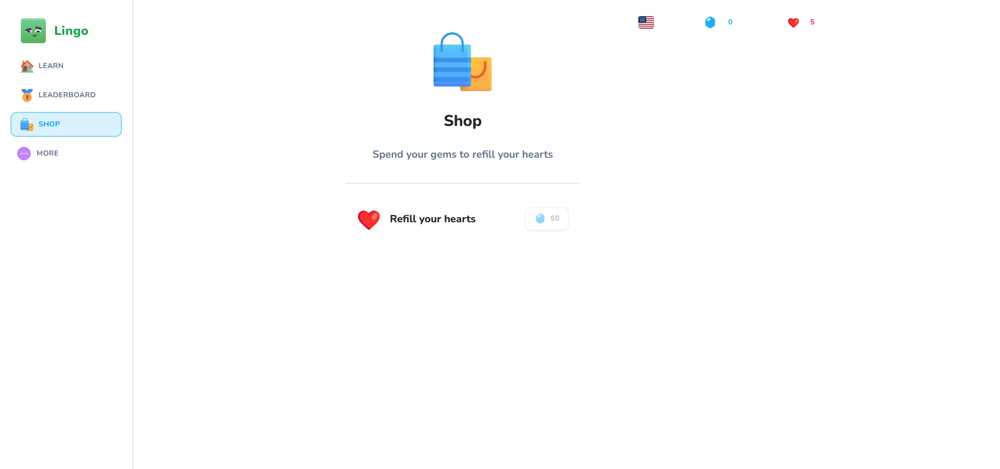
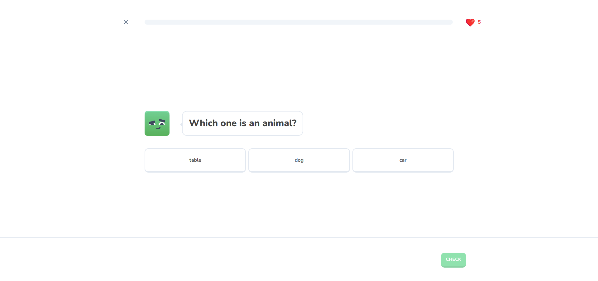
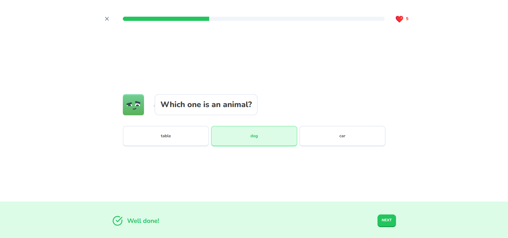
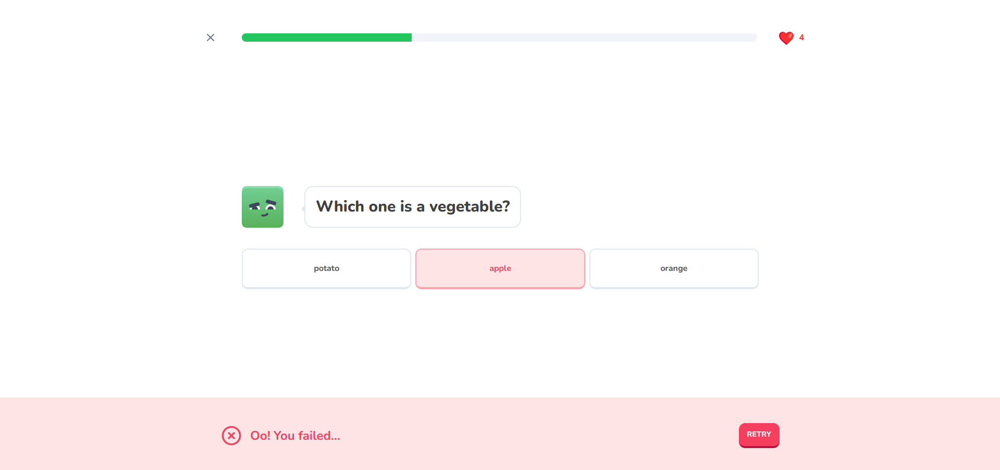

# Lingo

## MERN Stack Duolingo Clone

### Tech Stack

React.js

Node.js

Express.js

MongoDB

Redux(toolkit)

Typescript

Axios

React Router Dom

TailwindCSS

React Hook Form

Zod

### Features

Authentication and Authorization with Json Web Tokens (login, register, logout)

Take lessons

## Images

### Login Page

### Register Page

### Leaderboard Page

### Lessons Page

### Shop Page

### Lesson Page

### Lesson Page

### Lesson Page

